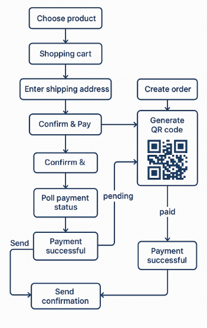

# 🛒 QR Payment Demo Shop

Demo shop bán hàng trực tuyến tích hợp thanh toán QR và quản lý đơn hàng. Người dùng có thể chọn sản phẩm, thanh toán bằng cách quét mã QR, và theo dõi trạng thái đơn hàng theo thời gian thực.

---

## 🎯 Mục tiêu

- Giao diện frontend đẹp, responsive.
- Trang landing chứa 12 sản phẩm.
- Giỏ hàng: thêm/xóa/sửa số lượng.
- Nhập địa chỉ giao hàng.
- Tạo QR code thanh toán.
- Theo dõi trạng thái thanh toán (pending → paid).
- Gửi thông báo khi thanh toán thành công.

---

## 📁 Cấu trúc thư mục

cd backend
go mod tidy
go run main.go
- `frontend/`: Mã nguồn ứng dụng Next.js.
- `backend/`: Mã nguồn ứng dụng Go.

##🔁 Quy trình hoạt động
-Người dùng chọn sản phẩm → giỏ hàng → nhập địa chỉ → bấm Confirm & Pay.
-Frontend gọi API /api/create-order.
-Backend:
-Tạo order_id.
-Sinh QR code (base64).
-Lưu trạng thái pending.
-Frontend redirect đến /pay/[order_id]:
-Hiển thị QR code.
-Poll API /api/payment-status mỗi 3 giây.
-Khi thanh toán thành công:
-Backend cập nhật trạng thái paid.
-Gửi thông báo (email/Zalo/callback).
-Frontend hiển thị trạng thái đã thanh toán.